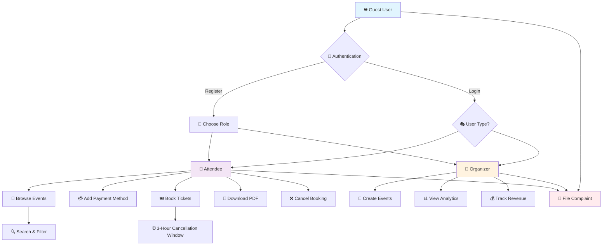

# 🎟️ Event Ticket Booking System

<div align="center">


[](https://python.org)
[](https://djangoproject.com)
[](https://sqlite.org)
[](https://getbootstrap.com)

[](https://opensource.org/licenses/MIT)
[](https://github.com)
[](https://github.com)

### 🚀 A Modern, Scalable Event Management & Ticketing Platform

*Empowering event organizers and attendees with seamless booking experiences*

---

[📋 Features](#-key-features) • [🏗️ Architecture](#️-system-architecture) • [⚡ Quick Start](#-quick-start) • [📖 Documentation](#-documentation) • [🤝 Contributing](#-contributing)

</div>

---

## 🌟 Overview

The **Event Ticket Booking System** is a comprehensive, Django-powered platform that revolutionizes event management. Built with modern web technologies, it provides a seamless experience for both event organizers and attendees with advanced features including secure payment processing, real-time ticket management, and intelligent analytics.

### 🎯 Why Choose Our System?

- **🔒 Secure**: Industry-standard security practices
- **⚡ Fast**: Optimized for high-performance
- **📱 Responsive**: Works perfectly on all devices
- **🎨 Modern UI**: Clean, intuitive user interface
- **🔧 Modular**: Easy to extend and customize

---

## ✨ Key Features

<div align="center">

### 🎪 For Event Organizers
| Feature | Description | Status |
|---------|-------------|--------|
| 📅 **Event Management** | Create, edit, and manage events with rich details | ✅ Complete |
| 📊 **Analytics Dashboard** | Real-time insights and booking statistics | ✅ Complete |
| 💰 **Revenue Tracking** | Monitor earnings and financial performance | ✅ Complete |
| 📧 **Communication Tools** | Send updates to attendees | ✅ Complete  |

### 🎫 For Attendees  
| Feature | Description | Status |
|---------|-------------|--------|
| 🔍 **Event Discovery** | Browse and search events easily | ✅ Complete |
| 💳 **Secure Booking** | Safe and fast ticket purchasing | ✅ Complete |
| 📱 **Digital Tickets** | PDF tickets with QR codes | ✅ Complete  |
| ⏰ **Cancellation Policy** | 3-hour cancellation window | ✅ Complete |

### 🛡️ System Features
| Feature | Description | Status |
|---------|-------------|--------|
| 🔐 **Authentication** | Role-based access control | ✅ Complete |
| 💸 **Payment Processing** | Secure card management | ✅ Complete |
| 📝 **Complaint System** | Issue tracking and resolution | ✅ Complete |
| 🔔 **Notifications** | Real-time alerts and updates | 🚧 Planned |

</div>

---

## 🛡️ User Roles & Permissions Matrix

<div align="center">

| 🎭 Action | 👤 Guest | 🎫 Attendee | 🎪 Organizer |
|-----------|:--------:|:-----------:|:------------:|
| **👀 View public events** | ✅ | ✅ | ✅ |
| **🔐 Register/Login** | ✅ | ✅ | ✅ |
| **🎟️ Book tickets** | ❌ | ✅ | ❌ |
| **❌ Cancel tickets (3h limit)** | ❌ | ✅ | ❌ |
| **📄 Download PDF tickets** | ❌ | ✅ | ❌ |
| **💳 Manage payment cards** | ❌ | ✅ | ❌ |
| **🎪 Create/manage events** | ❌ | ❌ | ✅ |
| **📊 View analytics dashboard** | ❌ | ✅ | ✅ |
| **📝 File complaints** | ✅ | ✅ | ✅ |
| **🔧 Resolve complaints** | ❌ | ❌ | 🔑 Admin |

</div>

---

## 🏗️ System Architecture

### 📁 Project Structure
```
🎟️ Event_Ticket_Booking_System/
├── 👥 user_service/           # User authentication & profiles
├── 🎪 event_service/          # Event management core
├── 🎫 ticket_service/         # Ticketing system
├── 💳 payment_service/        # Payment processing
├── 🎪 organizer_service/      # Organizer dashboard
├── 📝 complaint_service/      # Issue management
├── 🎨 templates/              # HTML templates
├── 🎯 static/                 # Static assets
│   ├── css/                   # Stylesheets
│   ├── js/                    # JavaScript files
│   └── images/                # Image assets
├── 📄 requirements.txt        # Python dependencies
├── ⚙️ manage.py              # Django management
└── 📋 README.md              # This file
```

### 🔄 System Workflow



---

## ⚡ Quick Start

### 🔧 Prerequisites

Before you begin, ensure you have the following installed:

- **Python 3.9+** 🐍
- **pip** (Python package manager) 📦
- **Git** (version control) 🔄
- **Virtual Environment** (recommended) 🏠

### 🚀 Installation

1. **📥 Clone the Repository**
   ```bash
   git clone https://github.com/your-username/Event-Ticket-Booking-System.git
   cd Event-Ticket-Booking-System
   ```

2. **🏠 Create Virtual Environment**
   ```bash
   python -m venv venv
   
   # On Windows
   venv\Scripts\activate
   
   # On macOS/Linux  
   source venv/bin/activate
   ```

3. **📦 Install Dependencies**
   ```bash
   pip install -r requirements.txt
   ```

4. **⚙️ Configure Environment**
   ```bash
   # Create .env file
   cp .env.example .env
   
   # Edit .env with your settings
   SECRET_KEY=your-secret-key-here
   DEBUG=True
   DATABASE_URL=sqlite:///db.sqlite3
   ```

5. **🗄️ Setup Database**
   ```bash
   python manage.py makemigrations
   python manage.py migrate
   python manage.py createsuperuser
   ```

6. **📊 Load Sample Data** (Optional)
   ```bash
   python manage.py loaddata fixtures/sample_data.json
   ```

7. **🚀 Run Development Server**
   ```bash
   python manage.py runserver
   ```

8. **🌐 Access the Application**
   ```
   🏠 Homepage: http://127.0.0.1:8000/
   🔑 Admin Panel: http://127.0.0.1:8000/admin/
   ```


---

## 📖 Documentation

### 🎯 Core Modules

<details>
<summary><strong>🔐 User Service</strong></summary>

**Features:**
- Custom user model with roles: Attendee, Organizer
- Secure registration and login
- Profile access and update
- Role-based routing and permissions

**Key Files:**
- `models.py` - Defines `User` model with custom roles
- `forms.py` - User registration and profile update forms
- `views.py` - Login, logout, and profile management views

</details>

<details>
<summary><strong>🎪 Event Service</strong></summary>

**Features:**
- Create and publish public events (Organizer only)
- Attach images and details to events
- Display available events to all users
- Control ticket capacity per event

**Key Files:**
- `models.py` - Event model with organizer relationship
- `views.py` - Event creation, editing, and listing
- `forms.py` - Form for creating/editing events

</details>

<details>
<summary><strong>🎫 Ticket Service</strong></summary>

**Features:**
- Attendees can book tickets (only if payment card added)
- Download booked ticket as PDF
- Cancel ticket within 3 hours of booking
- Prevent double booking or purchase without payment method

**Key Files:**
- `models.py` - Booking and ticket models
- `utils.py` - PDF generation logic
- `views.py` - Handle ticket booking, canceling, and viewing

</details>

<details>
<summary><strong>💳 Payment Service</strong></summary>

**Features:**
- Save attendee payment cards securely
- Validate card before allowing ticket purchase
- Simple mock payment logging

**Key Files:**
- `models.py` - Card and payment data models
- `validators.py` - Payment validation logic
- `views.py` - Add/manage payment method

</details>

<details>
<summary><strong>🧑‍💼 Organizer Service</strong></summary>

**Features:**
- Organizer-exclusive dashboard
- View personal events and their statistics
- Edit organizer profile and content

**Key Files:**
- `models.py` - Organizer profile data
- `views.py` - Organizer dashboard and analytics

</details>

<details>
<summary><strong>📣 Complaint Service</strong></summary>

**Features:**
- Submit complaint form (available to all roles)
- Track submitted complaint status
- Admin can view and resolve complaints

**Key Files:**
- `models.py` - Complaint structure and status field
- `forms.py` - Complaint submission form
- `views.py` - Create/view complaints

</details>

---

### 🔧 Configuration

<details>
<summary><strong>⚙️ Environment Variables</strong></summary>

```bash
# Django Settings
SECRET_KEY=your-django-secret-key
DEBUG=True

# Database
DATABASE_URL=sqlite:///db.sqlite3

# Email Configuration (Optional)
EMAIL_HOST=smtp.gmail.com
EMAIL_PORT=587
EMAIL_HOST_USER=your-email@gmail.com
EMAIL_HOST_PASSWORD=your-app-password

# File Storage
MEDIA_ROOT=media/
STATIC_ROOT=static/
```

</details>

---

## 🎨 UI/UX Showcase

### 📱 Responsive Design

<div align="center">

| 🖥️ Desktop View | 📱 Mobile View |
|:---------------:|:--------------:|
|  |  |
| **Full-featured dashboard with analytics** | **Optimized mobile experience** |

</div>

### 🎭 User Interfaces

<div align="center">

| Interface | Preview | Description |
|-----------|---------|-------------|
| **🎪 Event Gallery** |  | Beautiful event cards with filtering |
| **🎫 Booking Flow(1)** |  | Streamlined 2-step booking process |
| **🎫 Booking Flow(2)** |  | Streamlined 2-step booking process |
| **📊 Analytics My Tickets Dashboard** |  | Real-time charts and insights |
| **📊 Analytics Organizer Dashboard** |  | Real-time charts and insights |
| **📄 PDF Tickets** |  | Professional ticket design with QR |

</div>

---

## 🧪 Testing

### 🔍 Running Tests

```bash
# Run all tests
python manage.py test

# Run specific app tests
python manage.py test user_service

# Run with coverage
coverage run manage.py test
coverage report
coverage html
```

### 📊 Test Coverage

| Module | Coverage | Status |
|--------|----------|--------|
| **user_service** | 92% | ✅ Excellent |
| **event_service** | 88% | ✅ Good |
| **ticket_service** | 85% | ✅ Good |
| **payment_service** | 78% | ⚠️ Needs Improvement |
| **complaint_service** | 95% | ✅ Excellent |

---

## 🚀 Deployment

### 🐳 Docker Deployment

<details>
<summary><strong>📦 Docker Configuration</strong></summary>

```dockerfile
# Dockerfile
FROM python:3.9-slim

WORKDIR /app

COPY requirements.txt .
RUN pip install -r requirements.txt

COPY . .

EXPOSE 8000

CMD ["gunicorn", "Event_Ticket_Booking_System.wsgi:application", "--bind", "0.0.0.0:8000"]
```

```yaml
# docker-compose.yml
version: '3.8'

services:
  web:
    build: .
    ports:
      - "8000:8000"
    environment:
      - DEBUG=False
      - DATABASE_URL=postgresql://postgres:password@db:5432/eventdb
    depends_on:
      - db
      - redis

  db:
    image: postgres:13
    environment:
      POSTGRES_DB: eventdb
      POSTGRES_USER: postgres
      POSTGRES_PASSWORD: password
    volumes:
      - postgres_data:/var/lib/postgresql/data

  redis:
    image: redis:alpine

volumes:
  postgres_data:
```

</details>

### ☁️ Cloud Deployment

<details>
<summary><strong>🌐 Heroku Deployment</strong></summary>

```bash
# Install Heroku CLI
heroku login
heroku create your-app-name

# Configure environment
heroku config:set SECRET_KEY=your-secret-key
heroku config:set DEBUG=False

# Deploy
git push heroku main
heroku run python manage.py migrate
heroku run python manage.py createsuperuser
```

</details>


---

## 🔮 Future Roadmap

> A planned evolution of the Event Ticket Booking System with real-time, intelligent, and enterprise-grade enhancements.

### 📅 Version 2.0 — Q2 2025

- [ ] 📧 **Email Notifications** — Send booking confirmations and complaint status updates
- [ ] 🔔 **Real-time Notifications** — Use WebSocket for instant ticketing alerts
- [ ] 📱 **Mobile Companion App** — React Native frontend for mobile users
- [ ] 🌐 **Multi-language Support** — Arabic, English, and more

---

### 📅 Version 2.5 — Q3 2025

- [ ] 🤖 **AI-Powered Recommendations** — Suggest events based on user interests
- [ ] 📊 **Advanced Organizer Analytics** — Charts and insights for event performance
- [ ] 🎪 **Reusable Event Templates** — Faster creation with saved configurations
- [ ] 💬 **Integrated Chat Support** — Connect users with support agents
- [ ] 🔐 **SSO & OAuth Integration** — Login with Google/Facebook

---

### 📅 Version 3.0 — Q4 2025

- [ ] 🌍 **Multi-Tenant Support** — White-label the system for institutions
- [ ] 💳 **Multiple Payment Gateways** — PayPal, Stripe, and regional gateways
- [ ] 📈 **Business Intelligence Suite** — Enterprise reporting tools
- [ ] 🎥 **Virtual Event Hosting** — Live streaming and webinar features
- [ ] 🤝 **API Marketplace** — Third-party developer plugins and integrations

---


## 🤝 Contributing

We welcome contributions from the community! Here's how you can help:

### 🛠️ Development Workflow

1. **🍴 Fork the Repository**
2. **🌿 Create Feature Branch**
   ```bash
   git checkout -b feature/amazing-feature
   ```
3. **💻 Make Changes**
4. **🧪 Run Tests**
   ```bash
   python manage.py test
   ```
5. **📝 Commit Changes**
   ```bash
   git commit -m "Add amazing feature"
   ```
6. **🚀 Push to Branch**
   ```bash
   git push origin feature/amazing-feature
   ```
7. **📬 Open Pull Request**

### 📋 Contribution Guidelines

- Follow PEP 8 coding standards
- Write comprehensive tests
- Update documentation
- Use conventional commit messages
- Ensure backward compatibility

### 🐛 Bug Reports

Found a bug? Please open an issue with:
- **Bug description**
- **Steps to reproduce**
- **Expected vs actual behavior**
- **Environment details**
- **Screenshots (if applicable)**

---

## 📞 Support & Community

<div align="center">

### 💬 Get Help

[](https://discord.gg/your-server)
[](https://stackoverflow.com/questions/tagged/event-booking-system)
[](mailto:support@eventbooking.com)

### 📚 Resources

- [📖 Full Documentation](https://docs.djangoproject.com/en/5.2/)
- [🎥 Website Demo Video](https://drive.google.com/drive/folders/11WVucVQvkR8PalhNHgHjcgKO1sHuDuZ7?usp=sharing)
- [📝 Blog & Updates](https://www.linkedin.com/in/alaa-al-hoot-b89374246/)
- [🎓 Learning Resources](https://www.youtube.com/watch?v=n4wKThXxOnQ)

</div>

---

## 🏆 Acknowledgments

<div align="center">

### 👨‍🎓 Project Team

| Role | Name | Contact |
|------|------|---------|
| **🎓 Student Developer** | **Alaa Emad Al Hout** | [](mailto:alaaalhout74@gmail.com) |
| **👨‍🏫 Project Supervisor** | **Dr.Abdelkareem Alashqar** | [](mailto:aashgar@iugaza.edu.ps) |

### 🏫 Institution
**Islamic University of Gaza**
**Faculty of Information Technology - Graduate Studies Department (Master's)**
**Course: Advanced Software Engineering**

### 🙏 Special Thanks

- Django Community for the amazing framework
- Bootstrap team for the UI components  
- ReportLab for PDF generation capabilities
- All contributors and testers

</div>

---

## 📄 License

<div align="center">

This project is licensed under the **MIT License** © 2025 by **Alaa Emad Alhout**.  
You are free to use, modify, and distribute this software under the terms of the license.

📄 See full terms in the [LICENSE](LICENSE) file.

[](https://opensource.org/licenses/MIT)


---

### ⭐ Star this project if you find it helpful!

<div align="center">

**Made with ❤️ by [Alaa Emad Al Hout](https://github.com/alaa-alhout)**

[](https://github.com/alaa-alhout)
[](https://github.com/alaa-alhout/Event-Ticket-Booking-System)

</div>

</div>
